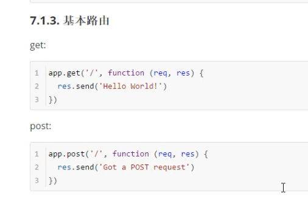
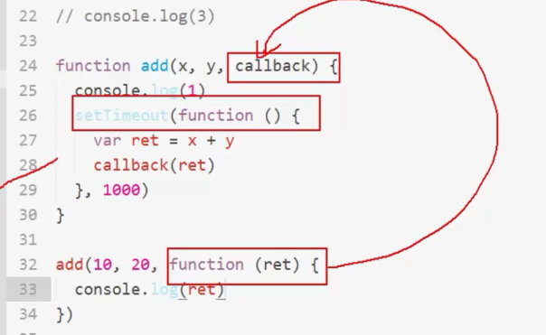

#### Express  一个web框架

官网： http://expressjs.com/

使用express框架有三大步骤

1. 查看文档，了解这是什么

2. 安装express -- 通过文档安装

   npm i -S express

   http://expressjs.com/en/starter/installing.html

3. 引用框架

4. 使用框架，可在官网查看文档，如何使用API

   http://expressjs.com/en/guide/routing.html

---

##### 修改完代码让服务器自动重启

​	-- 安装工具**nodemon**；  它会监视你的文件变化，保存就重启

​	-- npm install --global nodemon

​	-- 使用：用nodemon 替换 node 命令

​	    nodemon app.js

​	-- nodemon --version 可验证是否安装成功

#### 基本路由

就是多个人可以上网。。。可以区分是谁，给谁分配Ip /端口

现在就给谁分发/xxx  映射关系

借助路由表的原理吧，加上网关（守门大爷拿着路由表告诉你谁谁在哪）   

- 请求方法
- 请求路径
- 请求函数

原来，，连写跟jQuery一样是连在一起的，虽然是换行了。。。

~~~
http 
	.createServer(function(req,res){
		res.end('hello')
	})
	.listen(8888,function(){
		console.log('running...')
	})

~~~

官方文档  express  的 static file

#### static-server静态资源服务

use的第一个参数，省略与不省略的区别

+ app.use('/',express.static('./public/'))

  当以/public开头时，去./public目录中找对应的资源

+ 当app.use(express.static('./public/')) 

  省略了第一个参数，则访问时可以直接访问

  如本来是127.0.0.1:8888/public/login.html

  省略第一个参数后，可以这样访问 ：127.0.0.1:8888/login.html

- app.use('/abc/',express.static('./public/'))
  - app.use('/a/',express.static('./public/'))
  - 就是用前面设置的路径（/abc  ,/a）来访问./public目录

#### 回调函数

setTimeout是异步函数

callback是回调函数

