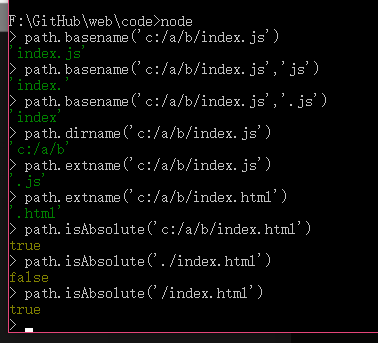

#### node设计的文件路径

在每个模块中，除了require,exports等模块相关API之外，还有两个特殊的成员：

+ __dirname动态获取  可以用来获取当前文件模块所属目录的绝对路径
+ __filename动太获取  可以用来获取当前文件的绝对路径

在文件操作中，使用相对路径是不可靠的，因为在Node中文件操作的路径被设计为相对于执行node命令所处的路径（不是bug,是故意这么设计 的，这样设计是有使用场景的）。

为了解决这个问题，只需要把相对路径变为绝对路径就行。

要变为绝对路径，可以使用 ```__dirname```或者 ``` __filename```来解决。

在拼接路径的过程中，为了避免手动拼接带来的一些低级错误，所以推荐多使用：path.join()来辅助拼接。

所以为了尽量避免使用手写的绝对路径产生移植不好的问题，所以在文件操作中应使用**动态的绝对路径**。

**注意：模块中的路径标识和这里的路径没有关系，不受影响（相对于文件模块），**

**文件操作路径中，相对路径设计的就是相对于执行 node 命令所处的路径。**

如：

~~~javascript
app.set('views',path.join(__dirname,'./views/')) //默认就是./views目录的绝对路径
~~~

~~~javascript
// 就是说，文件操作路径中，相对路径设计的就是相对于执行 node 命令所处的路径
// fs.readFile('C:/Users/lpz/Desktop/nodejs/06/code/foo/a.txt', 'utf8', function (err, data) {
// })

fs.readFile(path.join(__dirname, './a.txt'), 'utf8', function (err, data) {
})

~~~


#### path模块



相应的API在官网可查看: http://nodejs.cn/api/path.html

常用：path.join()