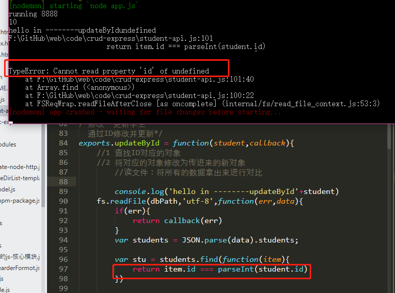
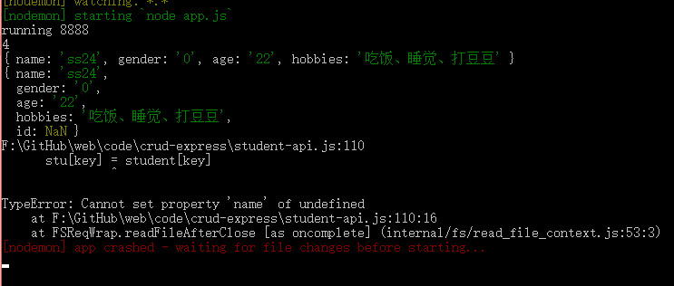
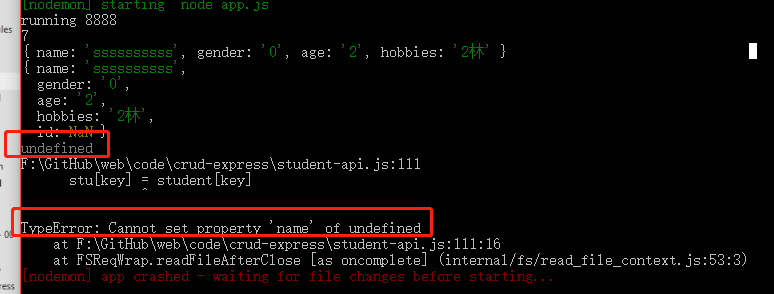

#### 实验步骤：

1. 创建目录结构

2. 入口程序app.js  调通服务器 -- express框架

3. 在bootstrap官网找到自己要用的网页框架，拿下来用

   https://v3.bootcss.com/getting-started/

   

4. 使用art-template模板渲染数据

5. 路由设计--查看需要哪些路由URL，实现路由页面

   | 请求方法 | 请求路径         | get 参数 | post 参数                      | 备注                       |
   | -------- | ---------------- | -------- | ------------------------------ | -------------------------- |
   | GET      | /studens         |          |                                | 渲染首页--index.html       |
   | GET      | /students/new    |          |                                | 渲染添加学生页面--new.html |
   | POST     | /studens/new     |          | name、age、gender、hobbies     | 处理添加学生请求--new.html |
   | GET      | /students/edit   | id       |                                | 渲染编辑页面               |
   | POST     | /studens/edit    |          | id、name、age、gender、hobbies | 处理编辑请求               |
   | GET      | /students/delete | id       |                                | 处理删除请求               |
   |          |                  |          |                                |                            |

6. 以json格式，将数据存到文件

   

7. 对文件数据进行增删改查API的封装

   

8. Post请求--中间件

   ***//这个post插件刚开始忘记引用了，一直报错都没找到原因*** 

   数据比较多，POST比较合适

   在Express中没有内置获取表单POST请求体的API，这里我们需要引入第三方包：body-parser.

   http://expressjs.com/en/resources/middleware.html  这官方网站里面，选择body-parser中间件查看文档

   1 安装

   ```shell
   npm install body-parser
   ```

   2 API

   ```shell
   # 配置 body-parser 中间件（插件，专门用来解析表单 POST 请求体）
   # parse application/x-www-form-urlencoded
   var bodyParser = require('body-parser')
   ```

   3 Examples

   ```javascript
   /*配置----------------------------------*/
   var express = require('express')
   //引包
   var bodyParser = require('body-parser')
   
   var app = express()
   
   /*配置body-parser
    	只要加入这个配置，则在req请求对象上会多出来一个属性：body
    	也就是说你可以直接通过req.body来获取表单POST请求体数据了*/
   // parse application/x-www-form-urlencoded
   app.use(bodyParser.urlencoded({ extended: false }))
   
   // parse application/json
   app.use(bodyParser.json())
   
   /*使用----------------------------------*/
   app.use(function (req, res) {
     res.setHeader('Content-Type', 'text/plain')
     res.write('you posted:\n')
     /*可以通过req.body来获取表单POST请求体数据*/
     res.end(JSON.stringify(req.body, null, 2))
   })
   ```

   


#### 常见BUG

### 1



一般出现这个问题，TypeError: Cannot read property 'id' of undefined


### 2



找不到原因 ，太揪心了

-----再重新打印一下



看到没，对象属性undefined，肯定是对象undefined，

刚是因为id没找着，这里edit.html里补上一个id


大多是id对应的这个对象找不到