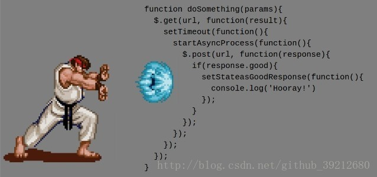

#### 回调地狱

 

无法保证顺序的代码

~~~javascript
//下面不一定按顺序
var fs = require('fs')

fs.readFile('./data/a.txt', 'utf8', function (err, data) {
  if (err) {
    // return console.log('读取失败')
    // 抛出异常
    //    1. 阻止程序的执行
    //    2. 把错误消息打印到控制台
    throw err
  }
  console.log(data)
})

fs.readFile('./data/b.txt', 'utf8', function (err, data) {
  if (err) {
    // return console.log('读取失败')
    // 抛出异常
    //    1. 阻止程序的执行
    //    2. 把错误消息打印到控制台
    throw err
  }
  console.log(data)      
})

fs.readFile('./data/c.txt', 'utf8', function (err, data) {
  if (err) {
    // return console.log('读取失败')
    // 抛出异常
    //    1. 阻止程序的执行
    //    2. 把错误消息打印到控制台
    throw err
  }
  console.log(data)
})

~~~

通过回调嵌套的方式保证顺序

~~~javascript
var fs = require('fs')

fs.readFile('./data/a.txt', 'utf8', function (err, data) {
  if (err) {
    // return console.log('读取失败')
    // 抛出异常
    //    1. 阻止程序的执行
    //    2. 把错误消息打印到控制台
    throw err
  }
  console.log(data)
  fs.readFile('./data/b.txt', 'utf8', function (err, data) {
    if (err) {
      // return console.log('读取失败')
      // 抛出异常
      //    1. 阻止程序的执行
      //    2. 把错误消息打印到控制台
      throw err
    }
    console.log(data)
    fs.readFile('./data/c.txt', 'utf8', function (err, data) {
      if (err) {
        // return console.log('读取失败')
        // 抛出异常
        //    1. 阻止程序的执行
        //    2. 把错误消息打印到控制台
        throw err
      }
      console.log(data)
    })
  })
})

~~~

为了解决以上编码方式带来的问题（回调地狱嵌套），所以在EcmaScript6中新增了一个API：Promise.

+ Promise

#### Promise

promise的使用

~~~javascript
var fs = require('fs')
//在ES6中新增了一个API Promise
//Promise 是一个构造函数

console.log(1)

//创建Promise容器
//1. 给别人一个承诺
//promise容器一旦创建，就开始执行里面的代码
var p1 = new Promise(function(resolve,reject){
	console.log(2)
	fs.readFile('./testFile/a.txt','utf8',function(err,data){
		if(err){
			//失败了，承诺容器中的任务失败了
			console.log(err)
			//将容器的Pending状态变为Rejected
			reject(err)
		}else{
			//失败了，承诺容器中的任务成功了
			console.log(3)
			console.log(data)
			//将容器的Pending状态变为Resolved
			resolve(data)
		}
	})
})
console.log(4)

//p1就是许的那个承诺
//当p1成功了  然后（then）做指定的操作
//then方法接收的function就是容器中的resolve函数
//第一个参数为resolve的那个，第二个参数为reject状态
p1.then(function(data){
	console.log(data)
},function(err){
	console.log('读取文件失败了',err)
})
~~~

promiseAPI封装

~~~javascript
var fs = require('fs')

function pReadFile(filePath) {
  return new Promise(function (resolve, reject) {
    fs.readFile(filePath, 'utf8', function (err, data) {
      if (err) {
        reject(err)
      } else {
        resolve(data)
      }
    })
  })
}

pReadFile('./data/a.txt')
  .then(function (data) {
    console.log(data)
    return pReadFile('./data/b.txt')
  })
  .then(function (data) {
    console.log(data)
    return pReadFile('./data/c.txt')
  })
  .then(function (data) {
    console.log(data)
  })

~~~

