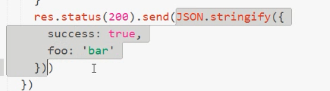
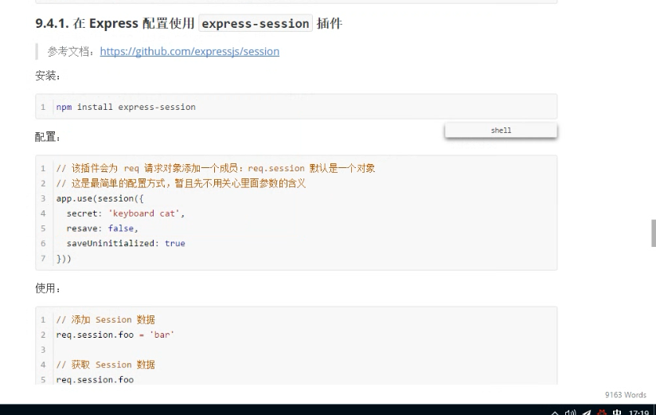
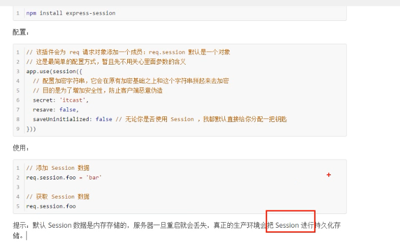
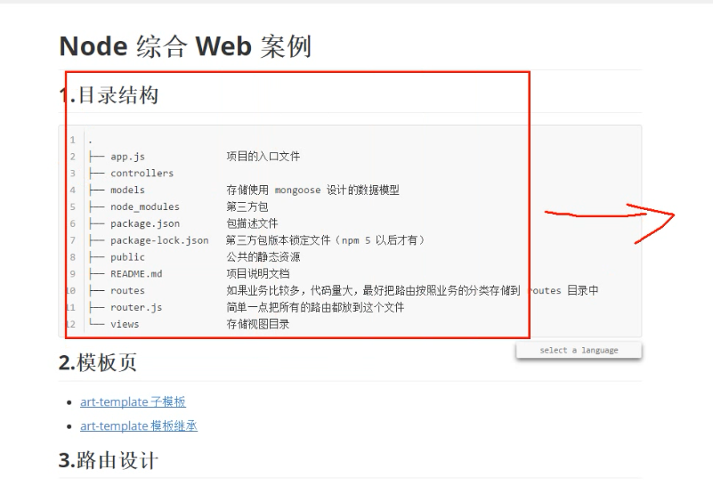
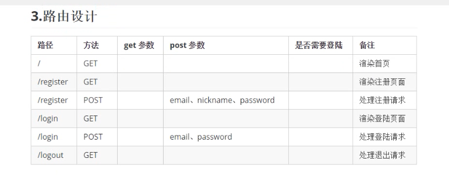
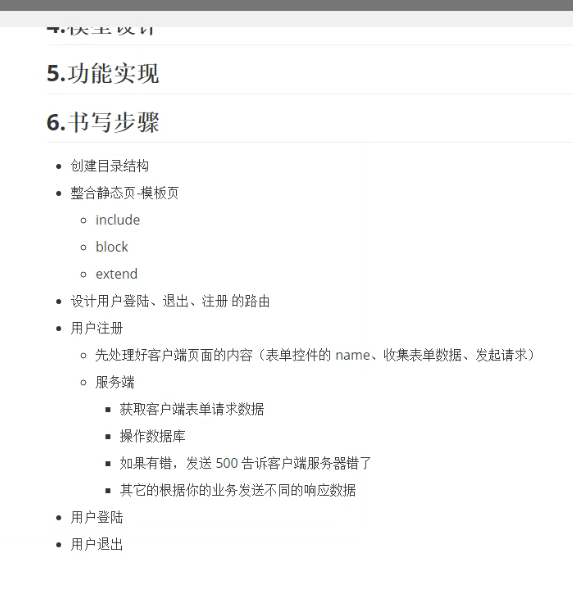

## Node综合Web案例

#### 1.目录结构


#### 2.设置路由


#### 3.引入POST解析插件


#### 4.配置数据模型（数据库操作）

  creat_time: {
    type: Date,
    default: Date.now      //这里没有直接加()是因为与了后会即刻调用； 这里只是给了一个方法，当new Model的时候，如果你没有传递creat_time，则mongoose就会调用default的值作为默认值
  },


#### 5.数据库操作

或查询

```
 $or: [
         {key1: value1}, {key2:value2}
      ]
```


#### 6.ajax和状态码设置



#### 7.MD5加密

https://github.com/blueimp/JavaScript-MD5

多层加密 


#### 8.表单同步、异步提交

      表单具有默认的提交行为，默认是同步的，同步表单提交，浏览器会锁死（转圈儿）等待服务端的响应结果。
      
        <form id="register_form" method="post" action="/register">
      表单的同步提交之后，无论服务端响应的是什么，都会直接把响应的结果覆盖掉当前页面。
    
      后来有人想到了一种办法，来解决这个问题。
      // Express 提供了一个响应方法：json
      // 该方法接收一个对象作为参数，它会自动帮你把对象转为字符串再发送给浏览器
      res.status(200).json({
        err_code: 0,
        message: 'OK'
      })
    
      // 服务端重定向只针对同步请求才有效，异步请求无效
      // res.redirect('/')
~~~
 <script>
    $('#register_form').on('submit', function (e) {
      e.preventDefault()
      var formData = $(this).serialize()
      $.ajax({
        url: '/register',
        type: 'post',
        data: formData,
        dataType: 'json',
        success: function (data) {
          var err_code = data.err_code
          if (err_code === 0) {
            // window.alert('注册成功！')
            // 服务端重定向针对异步请求无效
            window.location.href = '/'
          } else if (err_code === 1) {
            window.alert('邮箱已存在！')
          } else if (err_code === 2) {
            window.alert('昵称已存在！')
          } else if (err_code === 500) {
            window.alert('服务器忙，请稍后重试！')
          }
        }
      })
    })
  </script>
~~~


#### 9.通过Session保存登陆状态 

​	cookie在客户端本地，不安全，不能用来保存用户登陆状态

https://www.npmjs.com/package/express-session   进入官网找示例

// 在 Express 这个框架中，默认不支持 Session 和 Cookie
// 但是我们可以使用第三方中间件：express-session 来解决
// 1. npm install express-session
// 2. 配置 (一定要在 app.use(router) 之前)
// 3. 使用
//    当把这个插件配置好之后，我们就可以通过 req.session 来发访问和设置 Session 成员了
//    添加 Session 数据：req.session.foo = 'bar'
//    访问 Session 数据：req.session.foo


添加一个登录状态


## Installation

This is a [Node.js](https://nodejs.org/en/) module available through the [npm registry](https://www.npmjs.com/). Installation is done using the [`npm install` command](https://docs.npmjs.com/getting-started/installing-npm-packages-locally):

```
$ npm install express-session
```

## API

```
var session = require('express-session')
```

~~~

app.use(session({
  // 配置加密字符串，它会在原有加密基础之上和这个字符串拼起来去加密
  // 目的是为了增加安全性，防止客户端恶意伪造
  secret: 'itcast',
  resave: false,
  saveUninitialized: false // 无论你是否使用 Session ，我都默认直接给你分配一把钥匙
}))

~~~


## Example

A simple example using `express-session` to store page views for a user.

```
var express = require('express')
var parseurl = require('parseurl')
var session = require('express-session')
 
var app = express()
 
app.use(session({
  secret: 'keyboard cat',
  resave: false,
  saveUninitialized: true
}))
 
app.use(function (req, res, next) {
  if (!req.session.views) {
    req.session.views = {}
  }
 
  // get the url pathname
  var pathname = parseurl(req).pathname
 
  // count the views
  req.session.views[pathname] = (req.session.views[pathname] || 0) + 1
 
  next()
})
 
app.get('/foo', function (req, res, next) {
  res.send('you viewed this page ' + req.session.views['/foo'] + ' times')
})
 
app.get('/bar', function (req, res, next) {
  res.send('you viewed this page ' + req.session.views['/bar'] + ' times')
})
```





# 1



4 模型设计




