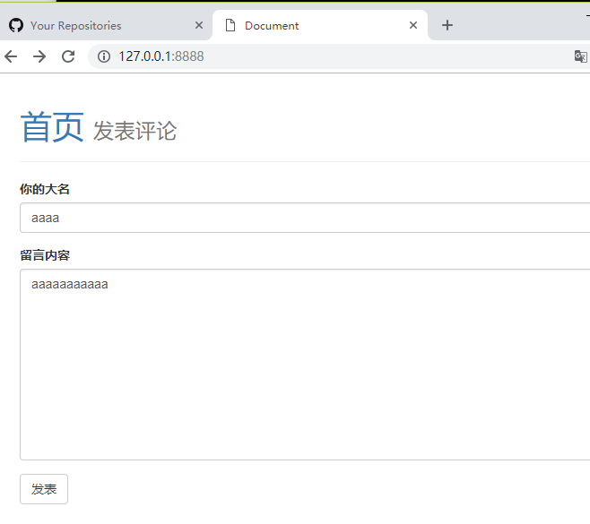
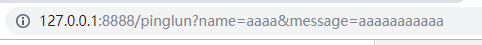
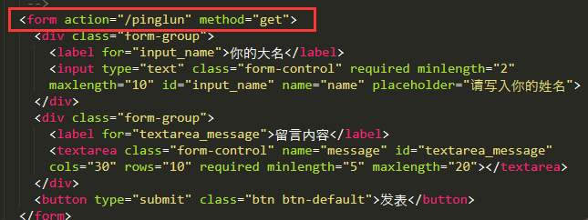
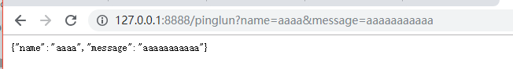
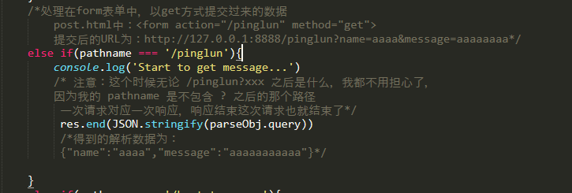

#### 目录结构：

+ get/  	 	 ---	  get方法的测试

+ get/app.js        ---     服务端程序  ，安装art-template包后可直接执行

+ get/post.html  ---     用于提交表单数据，测试get方法的

+ get/bootstrap.css  ---   一个样式，不用管

+ assets               ---     .md文件的图片

  

  #### 实验说明+内容解析：

  目的：测试get的提交方法，并使用url.parse解析

  ​	url.parse的解析可以参考文件：code/12url-model.js   

  使用方法：

   1.   在命令行进入get目录,并安装包  npm install art-template

  	2.  执行node app.js启动服务器

  	3.   启动成功后打开服务器，输入127.0.0.1:8888

       页面会显示留言板页面（就是post.html）
      
      4.  输入内容并提交 
      
       
      
      5.  实验是用get方法提交的，提交后可观察url的变化
      
       
      
       ​				http://127.0.0.1:8888/pinglun?name=aaaa&message=aaaaaaaaaaa

  ​     

  	6.  /pinglun是我们提交的form表单里面的action，后台会从中处理
  	
  	 可以观察post.html里面的代码
  	
  	 
  	
  	7.  提交后的结果显示为json格式数据
  	
  	 
  	
  	 这个是通过url.parse解析后，后台处理返回的
  	
  	 我们看下code/12url-model.js   的代码
  	
  	 主要区别看query的数据
  	
  	 ~~~javascript
  	 var url = require('url')
  	 
  	 var objfalse = url.parse('http://127.0.0.1:8888/pinglun?name=aaaa&message=aaaaaaaaaaa')
  	 
  	 var objtrue = url.parse('http://127.0.0.1:8888/pinglun?name=aaaa&message=aaaaaaaaaaa', true)
  	 
  	 console.log(objfalse)
  	 console.log(objfalse.query)
  	 
  	 console.log(objtrue)
  	 console.log(objtrue.query)
  	 
  	 /*get 主要是将数据以URL的方式发送
  	 post 是以集合的方式
  	 
  	 url.parse(url,true) 这里的true主要区别在query参数
  	 如下面的执行结果，参数为false则输出字符串形式：
  	   query: 'name=aaaa&message=aaaaaaaaaaa',
  	   如果参数为true，则输出为json格式对象：
  	   query: { name: 'aaaa', message: 'aaaaaaaaaaa' },
  	 */
  	 
  	 /*下面是执行结果
  	 F:\GitHub\web\node.js\code\GetPost\get>node url-model.js
  	 Url {
  	   protocol: 'http:',
  	   slashes: true,
  	   auth: null,
  	   host: '127.0.0.1:8888',
  	   port: '8888',
  	   hostname: '127.0.0.1',
  	   hash: null,
  	   search: '?name=aaaa&message=aaaaaaaaaaa',
  	   query: 'name=aaaa&message=aaaaaaaaaaa',
  	   pathname: '/pinglun',
  	   path: '/pinglun?name=aaaa&message=aaaaaaaaaaa',
  	   href:
  	    'http://127.0.0.1:8888/pinglun?name=aaaa&message=aaaaaaaaaaa' }
  	 
  	 name=aaaa&message=aaaaaaaaaaa
  	 
  	 Url {
  	   protocol: 'http:',
  	   slashes: true,
  	   auth: null,
  	   host: '127.0.0.1:8888',
  	   port: '8888',
  	   hostname: '127.0.0.1',
  	   hash: null,
  	   search: '?name=aaaa&message=aaaaaaaaaaa',
  	   query: { name: 'aaaa', message: 'aaaaaaaaaaa' },
  	   pathname: '/pinglun',
  	   path: '/pinglun?name=aaaa&message=aaaaaaaaaaa',
  	   href:
  	    'http://127.0.0.1:8888/pinglun?name=aaaa&message=aaaaaaaaaaa' }
  	 
  	 { name: 'aaaa', message: 'aaaaaaaaaaa' }
  	 
  	 */
  	 ~~~

  ​     

  	8.  后台app.js的处理方式如下：
  	
  	 
  	
  	 app.js的具体代码为：
  	
  	 ~~~javascript
  	 //建立服务器的第二种写法
  	 
  	 var http = require('http')
  	 var fs = require('fs')
  	 var url = require('url')

  ​     
       http 
       	.createServer(function(req,res){
       		/*url.parse函数详情见url-model.js*/
       		/*使用 url.parse 方法将路径解析为一个方便操作的对象，
       		第二个参数为 true 表示直接将查询字符串转为一个对象
       		（通过 query 属性来访问）*/
       		var parseObj = url.parse(req.url,true);
       		/*单独获取不包含查询字符串的路径部分（该路径不包含 ? 之后的内容）*/
           	var pathname = parseObj.pathname
       
       		if(pathname === '/'){
       			fs.readFile('post.html',function(err,data){
       				if(err){
       					return res.end('404 Not Found.')
       				}
       				res.end(data)
       			})			
       		}
       		/*处理在form表单中，以get方式提交过来的数据
           		post.html中：<form action="/pinglun" method="get">
           		提交后的URL为：http://127.0.0.1:8888/pinglun?name=aaaa&message=aaaaaaaa*/
       		else if(pathname === '/pinglun'){
       			console.log('Start to get message...') 
       			/* 注意：这个时候无论 /pinglun?xxx 之后是什么，我都不用担心了，
       			因为我的 pathname 是不包含 ? 之后的那个路径
             		 一次请求对应一次响应，响应结束这次请求也就结束了*/
             		 res.end(JSON.stringify(parseObj.query))
             		 /*得到的解析数据为：
             		 {"name":"aaaa","message":"aaaaaaaaaaa"}*/
       
       		}
       		else if(pathname === '/bootstrap.css'){
       			fs.readFile('bootstrap.css',function(err,data){
       				if(err){
       					return res.end('404 Not Found.')
       				}
       				res.end(data)
       			})
       		}
       		else{
       			return res.end('404 Not Found.')
       		}
       	})
       	.listen(8888,function(){
       		console.log('running...')
       	})
       
       ~~~

  ​     

  	9.  顺便放下post.html的代码：
  	
  	 ~~~ html
  	 <!DOCTYPE html>
  	 <html lang="en">
  	 
  	 <head>
  	   <meta charset="UTF-8">
  	   <title>Document</title>
  	   <link rel="stylesheet" href="./bootstrap.css">
  	 </head>
  	 
  	 <body>
  	   

  	     

  	       <h1><a href="/">首页</a> <small>发表评论</small></h1>
  	     

  	   

  	   

  	     <!-- 
  	       以前表单是如何提交的？
  	       表单中需要提交的表单控件元素必须具有 name 属性
  	       表单提交分为：
  	         1. 默认的提交行为
  	         2. 表单异步提交
  	 
  	         action 就是表单提交的地址，说白了就是请求的 url 地址
  	         method 请求方法
  	             get
  	             post
  	      -->
  	     <form action="/pinglun" method="get">
  	       

  	         <label for="input_name">你的大名</label>
  	         <input type="text" class="form-control" required minlength="2" maxlength="10" id="input_name" name="name" placeholder="请写入你的姓名">
  	       

  	       

  	         <label for="textarea_message">留言内容</label>
  	         <textarea class="form-control" name="message" id="textarea_message" cols="30" rows="10" required minlength="5" maxlength="20"></textarea>
  	       

  	       <button type="submit" class="btn btn-default">发表</button>
  	     </form>
  	   

  	 </body>
  	 
  	 </html>
  	 
  	 ~~~

  ​     

  	10.  这样子，整个代码目录有这个文档就好了。。~当然，.md文档要同时下载accets文件夹.

