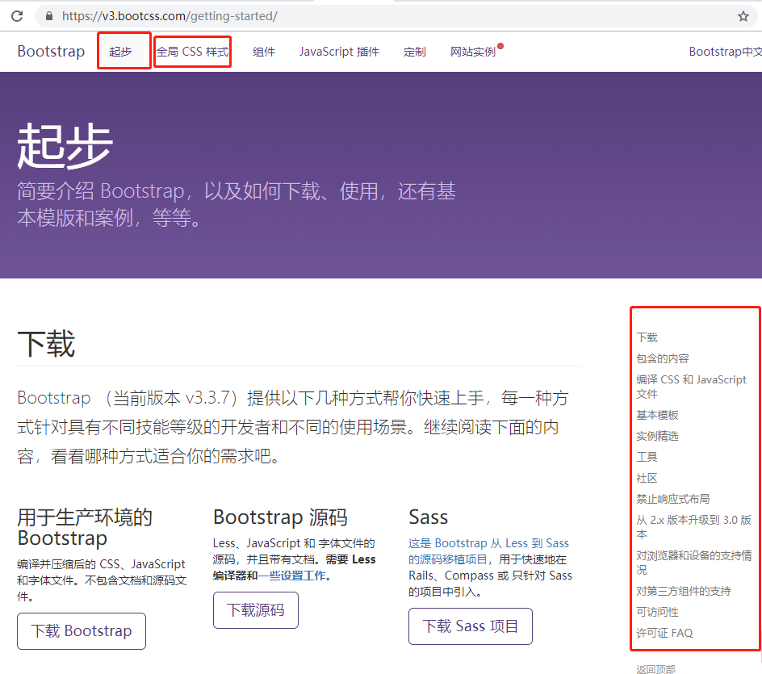

1. 创建目录结构

2. 入口程序app.js  调通服务器 -- express框架

3. 在bootstrap官网找到自己要用的网页框架，拿下来用

   https://v3.bootcss.com/getting-started/

   

4. 使用art-template模板渲染数据

5. 路由设计--查看需要哪些路由URL，实现路由页面

6. 以json格式，将数据存到文件

7. 对文件数据进行增删改查API的封装

8. 