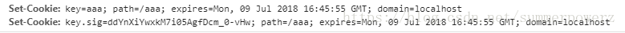
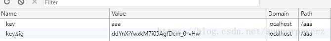

# KOA

一个跟express类似的框架 

https://github.com/koajs/koa


### Installation

Koa requires **node v7.6.0** or higher for ES2015 and async function support.

```
$ npm install koa --save
```

### Hello Koa

```
const Koa = require('koa');
const app = new Koa();

// response
app.use(ctx => {
  ctx.body = 'Hello Koa';
});

app.listen(3000);
```


# koa-router

https://github.com/alexmingoia/koa-router


## Installation

Install using [npm](https://www.npmjs.org/):

```
npm install koa-router
```

**Example**
Basic usage:

```
var Koa = require('koa');
var Router = require('koa-router');

var app = new Koa();
var router = new Router();

router.get('/', (ctx, next) => {
  // ctx.router available
});

app
  .use(router.routes())
  .use(router.allowedMethods());
```


# koa-static-cache

https://github.com/koajs/static-cache

**用koa-static-cache代替koa-static，可以减少加载文件大小**

## Installation

```
$ npm install koa-static-cache
```

## API

### staticCache(dir [, options][, files])

```
var path = require('path')
var staticCache = require('koa-static-cache')

app.use(staticCache(path.join(__dirname, 'public'), {
  maxAge: 365 * 24 * 60 * 60 
}))
```


# koa-cors

解决跨域请求

CORS middleware for Koa

Inspired by the great [node-cors](https://github.com/troygoode/node-cors) module.

## Installation (via [npm](https://npmjs.org/package/koa-cors))

```
$ npm install koa-cors
```

## Usage

```
var koa = require('koa');
var route = require('koa-route');
var cors = require('koa-cors');
var app = koa();
 
app.use(cors());
 
app.use(route.get('/', function() {
  this.body = { msg: 'Hello World!' };
}));
 
app.listen(3000);
```


# koa-better-body 

https://github.com/tunnckoCoreLabs/koa-better-body

## Install

```
npm i koa-better-body --save
```

## Usage

> For more use-cases see the [tests](https://github.com/tunnckoCoreLabs/koa-better-body/blob/master/test.js)

```
const koaBetterBody = require('koa-better-body')
```

### [koaBetterBody](https://github.com/tunnckoCoreLabs/koa-better-body/blob/master/index.js#L40)

> Robust body parser for [koa](https://github.com/koajs/koa)@1, also works for `koa@2` (with deprecations). Will also work for future `koa@3` with [koa-convert](https://github.com/gyson/koa-convert).

**Params**

- `options` **{Object}**: see more on [options section](https://github.com/tunnckoCoreLabs/koa-better-body#options)
- `returns` **{GeneratorFunction}**

**Example**

```
var koa = require('koa')
var body = require('koa-better-body')
var app = koa()

app
  .use(body())
  .use(function * () {
    console.log(this.request.body)    // if buffer or text
    console.log(this.request.files)   // if multipart or urlencoded
    console.log(this.request.fields)  // if json
  })
  .listen(8080, function () {
    console.log('koa server start listening on port 8080')
  })
```


# koa-bodyparser（获取post参数的中间件）


获取请求的参数
获取get请求的参数就比较简单了，可以直接通过ctx点语法出来，下面是获取get请求参数的代码

~~~
const Koa = require('koa')
const app = new Koa()

app.use( async (ctx) => {
    ctx.body = {
        url: ctx.url,
        ctx_query: ctx.query,
        ctx_querystring: ctx.querystring
    }
})

app.listen(3000, () => {
	console.log('start ok')
})
~~~


获取post请求参数，使用原生比较繁琐，需要转换，等等介绍一下使用中间件来获取post请求参数，就很简单方便了

~~~
//使用原生方式
const Koa = require('koa')
const app = new Koa()

app.use( async (ctx) => {
    let data = await parseData(ctx)
    ctx.body = data
})

app.listen(3000, () => {
    console.log('start ok')
})

function parseData(ctx) {
    return new Promise((resolve, reject) => {
        try {
            let str = ''
            ctx.req.on('data', (data) => {
                str += data
            })
            ctx.req.addListener('end', () => {
                resolve(parseUrl(str))
            })
        } catch (err) {
            reject(err)
        }
    });
}

function parseUrl(url) {
    let obj = {}
    let arr = url.split('&')
    arr.forEach((e, i) => {
        let temparr = e.split('=')
        obj[temparr[0]] = temparr[1]
    });
    return obj
}

~~~


下面这是使用中间件：koa-bodyparser，来获取post请求的参数
首先先得安装好中间件
npm install koa-bodyparser --save
安装好后，就试一试吧：
-----------------------------------------------
~~~
首先先得安装好中间件
npm install koa-bodyparser --save
安装好后，就试一试吧：
-----------------------------------------------
const Koa = require('koa')
const bodyParser = require('koa-bodyparser')

const app = new Koa()

app.use(bodyParser())

app.use( async (ctx) => {
    ctx.body =  ctx.request.body
})

app.listen(3000, () => {
    console.log('start ok')
})
------------------------------------------------
再于原生方式作对比，是不是很简单呢，直接一个，request.body就可以获取到post请求的参数了。

~~~


# koa-convert

http://npm.taobao.org/package/koa-convert

## Note

It should be able to convert any legacy generator middleware to modern promise middleware ( or convert it back ).

Please let me know ( send a issue ) if you fail to do so.

## Installation

```
$ npm install koa-convert
```

## Usage

```
const Koa = require('koa') // koa v2.x
const convert = require('koa-convert')
const app = new Koa()

app.use(modernMiddleware)

app.use(convert(legacyMiddleware))

app.use(convert.compose(legacyMiddleware, modernMiddleware))

function * legacyMiddleware (next) {
  // before
  yield next
  // after
}

function modernMiddleware (ctx, next) {
  // before
  return next().then(() => {
    // after
  })
}
```


# koa使用cookie

https://blog.csdn.net/summerpowerz/article/details/80979500

#### ctx.cookies.get(name, [options])

通过 options 获取 cookie name:

- signed 所请求的cookie应该被签名 

### ctx.cookies.set(name, value, [options])

通过 options 设置 cookie name 的 value :

- maxAge 一个数字表示从 Date.now() 得到的毫秒数 signed cookie 签名值 expires cookie 过期的
- Date path cookie 路径, 默认是’/’ domain cookie 域名 secure 安全 cookie
- httpOnly 服务器可访问 cookie, 默认是 true overwrite 一个布尔值，表示是否覆盖以前设置的同名的
- cookie (默认是 false). 如果是 true, 在同一个请求中设置相同名称的所有
- Cookie（不管路径或域）是否在设置此Cookie 时从 Set-Cookie 标头中过滤掉。 

### 使用

```
const Koa = require('koa');

const server = new Koa();
server.listen(8080);

server.keys = ["hello world"];
server.use(async (ctx) => {
    if (ctx.url === '/aaa') {
        ctx.cookies.set(
            'key',
            'aaa',
            {
                domain: 'localhost', 
                signed: true, 
                path: '/aaa',
                maxAge: 10 * 60 * 1000, 
                expires: new Date('2017-08-01'), 
                httpOnly: false,
                overwrite: false
            }
        );
        ctx.body = 'cookie set ok';
    } else {
        ctx.body = 'hello world!';
    }
});1234567891011121314151617181920212223242526
```





# koa-session

## **一、Koa-Session简单介绍**

session是另一种记录客户状态的机制，不同的是Cookie保存在客户端浏览器中，而session保存在服务器上。

## **二、Session的工作流程**

当浏览器访问服务器并发送第一次请求时，服务器端会创建一个session对象，生成一个类似于key,value的键值对， 然后将key(cookie)返回到浏览器(客户)端，浏览器下次再访问时，携带key(cookie)，找到对应的session(value)。 客户的信息都保存在session中

## 三、koa-session的使用: 

**1.安装**  **koa-session**

```
npm install koa-session --save
```

**2.引入express-session**

```
const session = require('koa-session');
```

 **3.设置官方文档提供的中间件**

```
app.keys = ['some secret hurr'];
const CONFIG = {
   key: 'koa:sess',   //cookie key (default is koa:sess)
   maxAge: 86400000,  // cookie的过期时间 maxAge in ms (default is 1 days)
   overwrite: true,  //是否可以overwrite    (默认default true)
   httpOnly: true, //cookie是否只有服务器端可以访问 httpOnly or not (default true)
   signed: true,   //签名默认true
   rolling: false,  //在每次请求时强行设置cookie，这将重置cookie过期时间（默认：false）
   renew: false,  //(boolean) renew session when session is nearly expired,
};
app.use(session(CONFIG, app));
```

**4.使用** 

```
     设置值 ctx.session.username = "张三";
     获取值 ctx.session.username
```

 

## **四、Koa中Cookie和Session区别**

1、cookie数据存放在客户的浏览器上，session数据放在服务器上。

2、cookie不是很安全，别人可以分析存放在本地的COOKIE并进行COOKIE欺骗

   考虑到安全应当使用session。

3、session会在一定时间内保存在服务器上。当访问增多，会比较占用你服务器的性能

   考虑到减轻服务器性能方面，应当使用COOKIE。

4、单个cookie保存的数据不能超过4K，很多浏览器都限制一个站点最多保存20个cookie。

 

## 五、官方Example

View counter example:

```
const session = require('koa-session');
const Koa = require('koa');
const app = new Koa();
 
app.keys = ['some secret hurr'];
 
const CONFIG = {
  key: 'koa:sess', /** (string) cookie key (default is koa:sess) */
  /** (number || 'session') maxAge in ms (default is 1 days) */
  /** 'session' will result in a cookie that expires when session/browser is closed */
  /** Warning: If a session cookie is stolen, this cookie will never expire */
  maxAge: 86400000,
  autoCommit: true, /** (boolean) automatically commit headers (default true) */
  overwrite: true, /** (boolean) can overwrite or not (default true) */
  httpOnly: true, /** (boolean) httpOnly or not (default true) */
  signed: true, /** (boolean) signed or not (default true) */
  rolling: false, /** (boolean) Force a session identifier cookie to be set on every response. The expiration is reset to the original maxAge, resetting the expiration countdown. (default is false) */
  renew: false, /** (boolean) renew session when session is nearly expired, so we can always keep user logged in. (default is false)*/
};
 
app.use(session(CONFIG, app));
// or if you prefer all default config, just use => app.use(session(app));
 
app.use(ctx => {
  // ignore favicon
  if (ctx.path === '/favicon.ico') return;
 
  let n = ctx.session.views || 0;
  ctx.session.views = ++n;
  ctx.body = n + ' views';
});
 
app.listen(3000);
console.log('listening on port 3000');
```


# Koa-pug（用的少）

A [Pug](https://github.com/pugjs) middleware for [Koa](http://koajs.com/).

# How to use

```
npm install koa-pug --save
const koa = require('koa')
const app = koa()
 
const Pug = require('koa-pug')
const pug = new Pug({
  viewPath: './views',
  debug: false,
  pretty: false,
  compileDebug: false,
  locals: global_locals_for_all_pages,
  basedir: 'path/for/pug/extends',
  helperPath: [
    'path/to/pug/helpers',
    { random: 'path/to/lib/random.js' },
    { _: require('lodash') }
  ],
  app: app // equals to pug.use(app) and app.use(pug.middleware)
})
 
pug.locals.someKey = 'some value'
 
app.use(function* () {
  this.render('index', locals_for_this_page, true)
})
```


# koa-ejs

Koa ejs view render middleware. support all feature of [ejs](https://github.com/mde/ejs). 

## Usage

### Example

```
const Koa = require('koa');
const render = require('koa-ejs');
const path = require('path');
 
const app = new Koa();
render(app, {
  root: path.join(__dirname, 'view'),
  layout: 'template',
  viewExt: 'html',
  cache: false,
  debug: true
});
 
app.use(async function (ctx) {
  await ctx.render('user');
});
 
app.listen(7001);
```

Or you can checkout the [example](https://github.com/koajs/ejs/tree/master/example).

### settings

- root: view root directory.
- layout: global layout file, default is `layout`, set `false` to disable layout.
- viewExt: view file extension (default `html`).
- cache: cache compiled templates (default `true`).
- debug: debug flag (default `false`).
- delimiter: character to use with angle brackets for open / close (default `%`).


