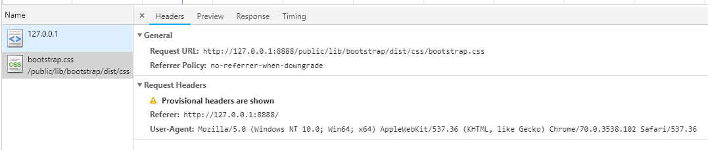

项目使用：

执行：运行server/app.js

打开浏览器输入：http://127.0.0.1:8888/

在运行server/app.js下安装包：npm install art-template 

***这个一定要自己重新下载，不然的话引入这个包会出现各种问题的。！！  复制的没用哦。。***

在服务端渲染

客户端与服务器文件应分开放置

1. 获取留言板路径

2. 读取html文件

3. 有一些文件请求，如link , script , img ,iframe video ,audio等具有src 或者link的href属性的标签（具有外链资源）时，浏览器会自动对这些资源发起新的请求（a标签除外）

4. 为了方便处理这些资源，我们习惯把这些东西放到一个公共的目录中

   在资源定位URL的时候，如果是在这个公共目录下，就直接把请求当作文件路径来直接进行读取

   下面是当成外链标签时请求失败的情况 

5. 添加两个页面： post 和 err

6. 将列表里面的数据渲染成更新的数据

   a. 引入模块

   b. 写模块，数据

   c. 在要渲染的数据那将模板给对应渲染上

7. 